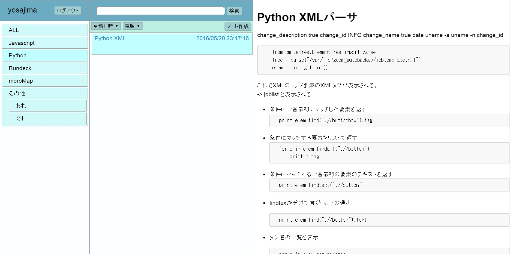
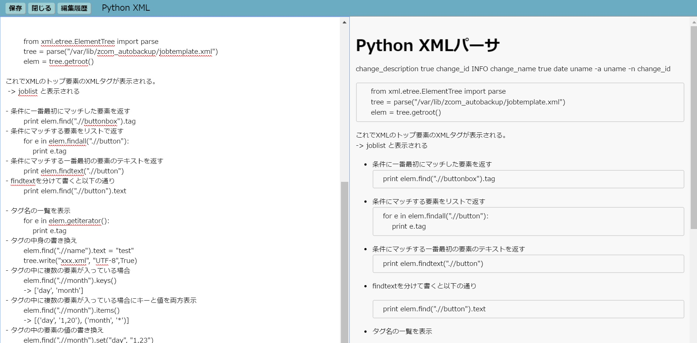

# moroNote
markdown editor web application.  

deploy on CentOS7.  
> yum install nodejs  
> yum install mongodb-server  
> cd /opt  
> git clone this project  
> cd moroNote/nodejs/config  
> vim default.json  
> systemctl start mongo  
> node moroNote/nodejs/server.js  

server listen on https.  

 
 

